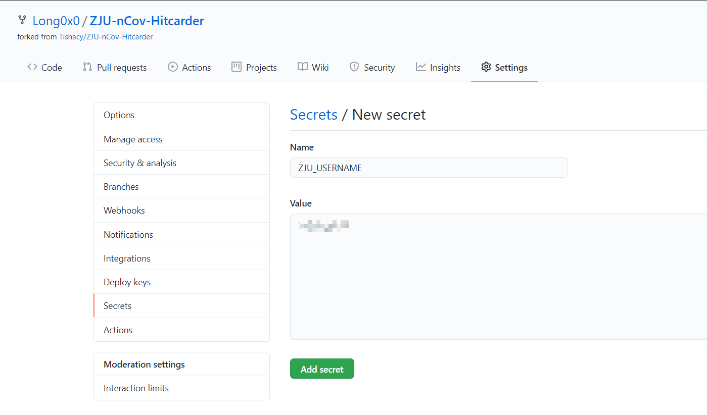
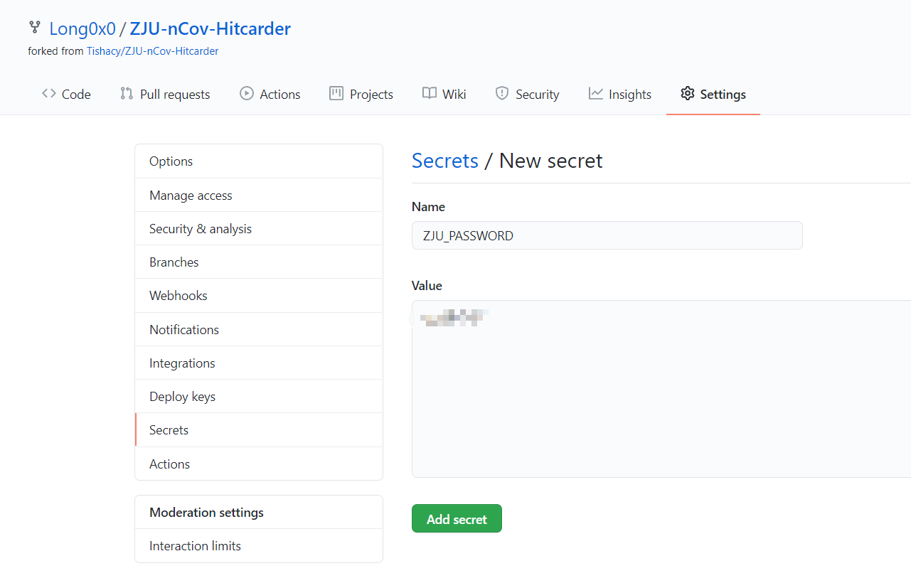
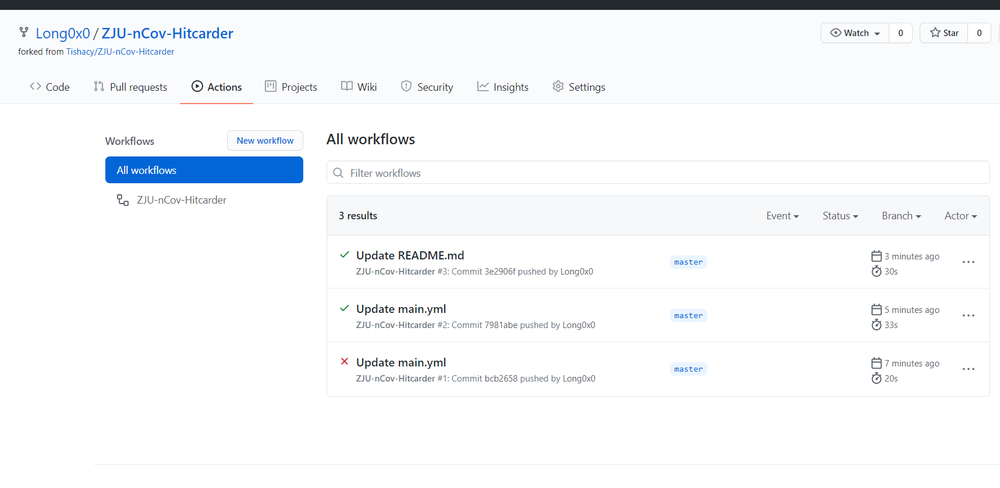
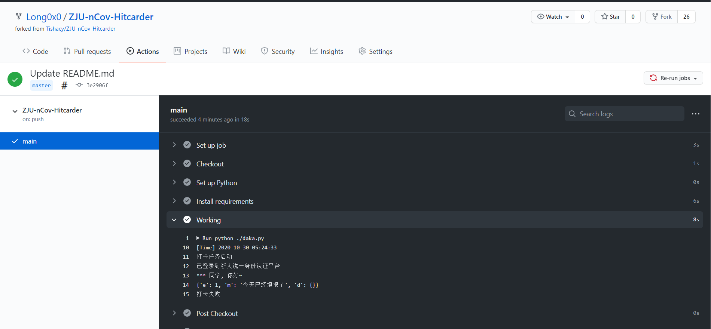

# ZJU-nCov-Hitcarder

浙大nCov肺炎健康打卡定时自动脚本 

forked from [Tishacy/ZJU-nCov-Hitcarder](https://github.com/Tishacy/ZJU-nCov-Hitcarder)


 - 使用 Github Actions 实现定时打卡，无需本地运行或部署在VPS
 - 打卡完成后可发送打卡成功或失败的微信/钉钉消息
 - 默认每次提交上次所提交的内容（只有时间部分更新）
 - 系统表单如有更新，在当天自行手机打卡，后面会自动按照你更新后的选项继续打卡
 - **项目用于学习交流，仅用于各项无异常时打卡，如有身体不适、所在地点改变等情况还请自行如实打卡！**


> 感谢[conv1d](https://github.com/conv1d)同学，已使用requests直接登录浙大统一认证平台，不再依赖phantomjs

## Usage

1. fork本项目
   
2. 配置帐号
   
   在项目的 Settings-Secrets 中添加 `ZJU_USERNAME`，内容为浙大通行证账号（学号），添加`ZJU_PASSWORD`，内容为浙大通行证密码。

   

   

3. 配置定运行时间
   
   在 .github\workflows\main.yml 中更改时间：
   ```yml
   on:
      push:
         branches:
            - master
      schedule:
         - cron: '0 23 * * *'
   ```
   `0 23 * * *`表示在每天UTC 23:00，也就是北京时间7:00运行。如果你想在每天早上9:30打卡，那么就应该设置为`30 1 * * *`。详见[这里](https://docs.github.com/en/free-pro-team@latest/actions/reference/events-that-trigger-workflows#scheduled-events)。
   
   PS:经过测试，实际运行时间比设定时间晚几分钟到几十分钟，~~原因大概是白嫖的人太多，github actions的服务器不够用了。。~~

4. 配置提醒方式（以下三种任选其一即可）
   
   1. 钉钉群机器人（PC端操作）
      
      - 打开新手体验群~~或者一个课程群~~，群设置-智能群助手-添加机器人-自定义，名字随便填，安全设置选择`自定义关键词`，填`打卡`，然后下一步复制Webhook。

         

         

      - 在github项目的 Settings-Secrets 中中添加`DINGTALK_TOKEN`，内容为刚才复制的Webhook中 `access_token=` 后面的内容。

      - 在 .github\workflows\main.yml 中将下面一行取消注释（前面的# 去掉）：
         ```yml
                 # DINGTALK_TOKEN: ${{ secrets.DINGTALK_TOKEN }}
         ```
      
   2. 微信ServerChan推送

      - 前往 http://sc.ftqq.com/3.version ，按首页的提示用GitHub账号登录，绑定微信，即可获得SCKEY。

         

         

      - 在github项目的 Settings-Secrets 中中添加`SERVERCHAN_KEY`，内容为刚才复制的SCKEY。

      - 在 .github\workflows\main.yml 中将下面一行取消注释（前面的# 去掉）：
         ```yml
                 # SERVERCHAN_KEY: ${{ secrets.SERVERCHAN_KEY }}
         ```

   3. 微信PUSHPLUS推送

      - 前往 https://pushplus.hxtrip.com ，微信扫码，点击激活消息，复制token。

         

      - 在github项目的 Settings-Secrets 中中添加`PUSHPLUS_TOKEN`，内容为刚才复制的token。

      - 在 .github\workflows\main.yml 中将下面一行取消注释（前面的# 去掉）：
         ```yml
                 # PUSHPLUS_TOKEN: ${{ secrets.PUSHPLUS_TOKEN }}
         ```

5. 测试
   
   由于在 .github\workflows\main.yml 中设置了代码有更新就触发运行，刚刚更改代码时可能就已经运行了几次。如果打卡成功，你将收到“打卡成功”的钉钉/微信消息，如果打卡失败或者今日已打卡，你将收到“打卡失败”。在项目的 Actions 一栏中可以看到每一次运行的log，点击右上角的 Re-run jobs 重新运行：

   

   

   


## Thanks

感谢原项目作者和贡献者

## 参考链接
GitHub Actions https://docs.github.com/en/free-pro-team@latest/actions

钉钉群机器人 https://ding-doc.dingtalk.com/doc#/serverapi3/iydd5h

ServerChan http://sc.ftqq.com/3.version

pushplus https://pushplus.hxtrip.com


## LICENSE

Copyright (c) 2020 tishacy.

Licensed under the [MIT License](https://github.com/Tishacy/ZJU-nCov-Hitcarder/blob/master/LICENSE)

